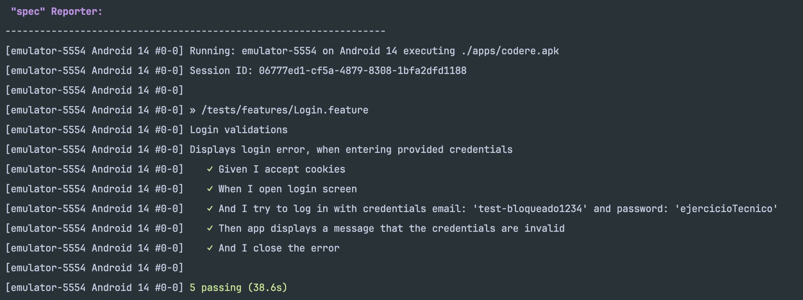

## How to run the tests
- Install `npm i`
- Launch the android device and specify the correct parameters in `./config/wdio.android.app.conf.js` or set `ANDROID_DEVICE_NAME` and `ANDROID_PLATFORM_VERSION` as env vars
- Launch appium `node ./node_modules/appium --address 0.0.0.0 --port 4723 --base-path=/`
- Launch the tests `npm run android:app`
- Check the report in the allure or in the console

Screenshot:

Video:

### P.S
Test credentials might be not valid
